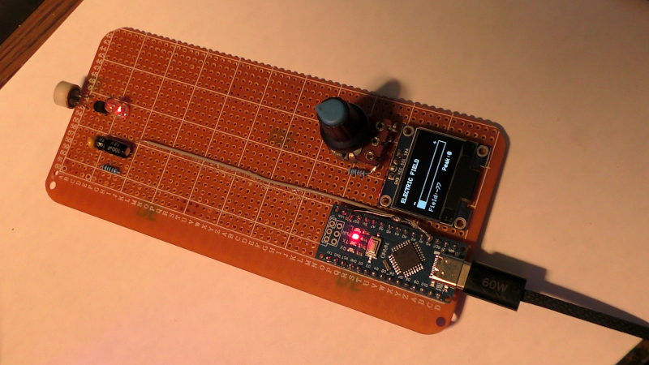

An ongoing DIY project to research and develop a DIY lightning/general electrostatics detection circuit.  
The project uses an Arduino Nano, SSD1306 screen and a simple detector circuit.   

The full circuit diagram is to follow, but the base circuit has been uploaded.  
See the Slider2732_ YouTube channel for more information and videos about this project.  
This project uses the Arduino IDE for code development.  
Current version is ElectrostaticDetector_V101.ino, which is Version 1.01
  

 
 
The required project parts:  
--- Processing section  
Arduino Nano  
SSD1306 128x64 I2C 
10K variable potentiometer  
22K resistor  
 
--- Sensor section   
100uf 16V electrolytic capacitor  
0.1uF ceramic capacitor  
68 ohms resistor  
C945 transistor  
5mm red LED
Elecret microphone (with metal can removed)
