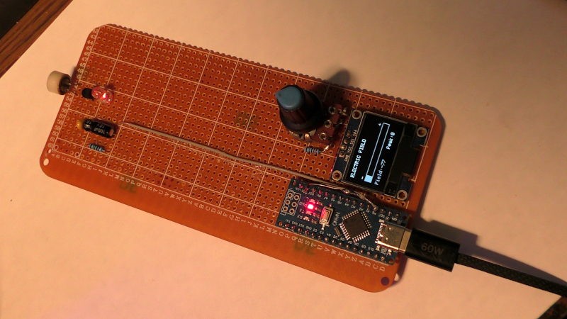

An ongoing DIY project to research and develop a DIY lightning/general electrostatics detection circuit.  
It was created to explore measurable environmental changes using inexpensive electronics. The device does not identify causes of detected changes; it provides repeatable readings that can be compared across locations and conditions.  
The project uses an Arduino Nano, SSD1306 screen and a simple detector circuit.   

The full circuit diagram is included above.  
See the Slider2732_ YouTube channel for more information and development videos.  
This project uses the Arduino IDE for code development.  
Current version is ElectrostaticDetector_V101.ino, which is Version 1.01
 
 
This instrument reports the change in the Arduino analogue reading from the calibration baseline. The displayed values are not calibrated electrostatic field strength (e.g. V/m), but relative measurements that allow repeatable comparisons between locations and conditions.
  
Note  
The grey wire running down the middle of the board is from the transistor Collector to Arduino A0 and is shielded (this one was from an ESP32 antenna extension). I tried unshielded and it did not work anywhere near as well as the shielded wire. Shield to circuit ground, core to transistor and A0.
 

 
 
The required project parts:  
--- Processing section  
Arduino Nano  
SSD1306 128x64 I2C 
10K variable potentiometer  
22K resistor  
 
Optional:
 
Small headphone type speaker  
1K variable potentiometer for sound volume
  
--- Sensor section   
100uf 16V electrolytic capacitor  
0.1uF ceramic capacitor  
68 ohms resistor  
C945 transistor  
5mm red LED
Elecret microphone (with metal can removed)
